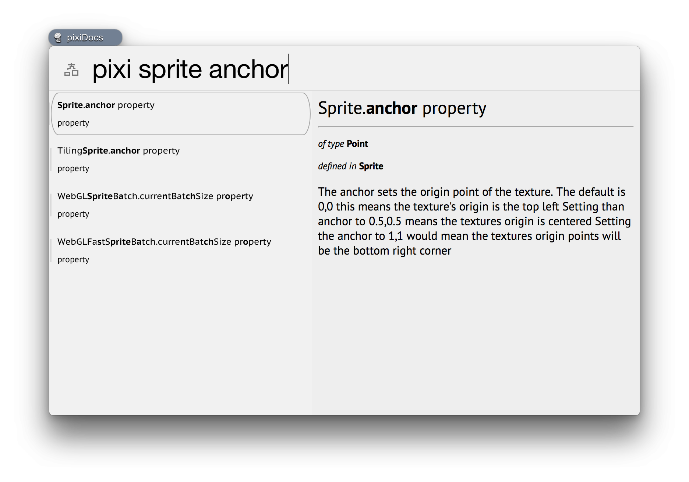

# pixiDocs

> Recipe for the documentation of pixi.js.

## Usage

The recipe doesn't require a query - it will pull the latest docs of pixi and will display an index with all classes, properties and methods.

```
pixi
```

To search the index simply provide a query for fuzzy matching. For example:

```
pixi sprite anchor
```

As with any other recipe, you can use regular expressions for more powerful queries - here is how we say we want only the Text class and all of its members:

```
pixi :r ^Text(\.|\s)
```



## Options

_(none)_

## Examples

```
pixi class // to list all classes
pixi property // list all properties
pixi method //list all methods
pixi :r ^Text(\.|\s) // class Text and all of it's members 
```

## Results

Every result points to the appropriate place on the documentation website of pixi.

## License

[MIT](/LICENSE-MIT)